# 主要景点

## 贝伦区
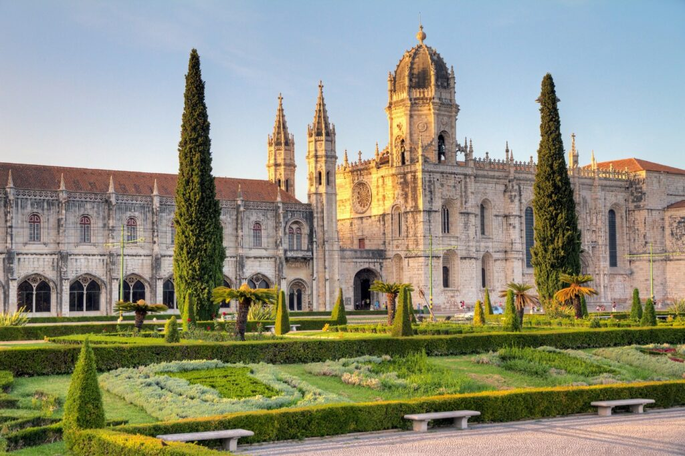

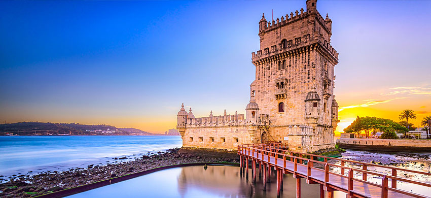

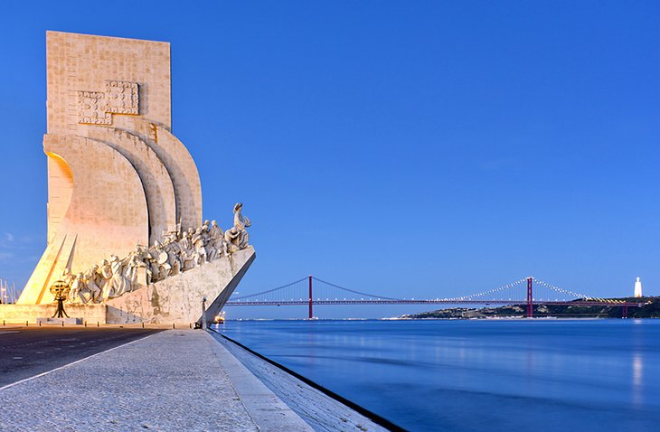

## 世博
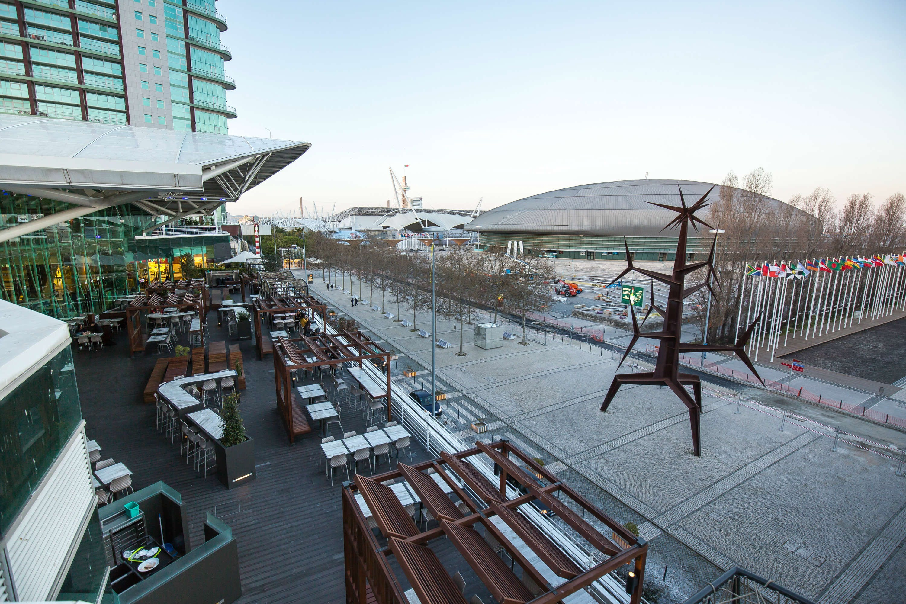
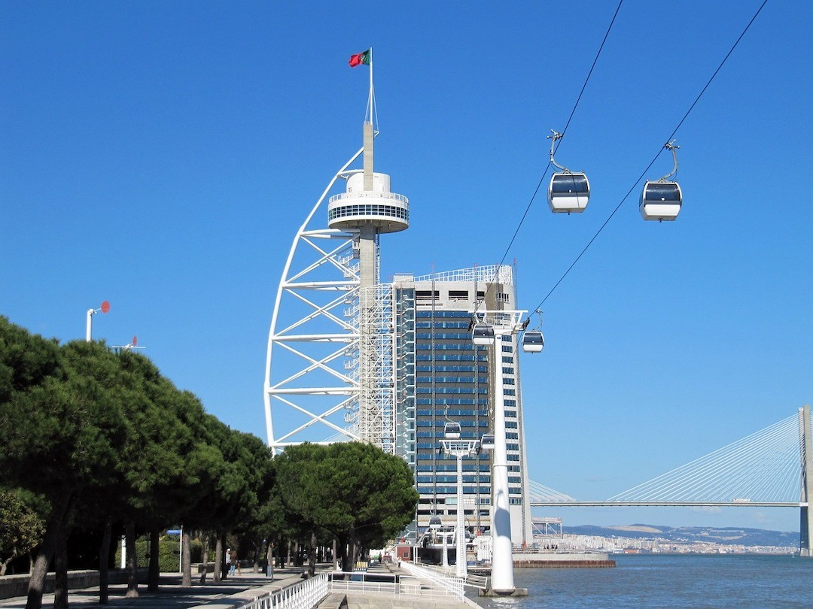

## 里斯本山上
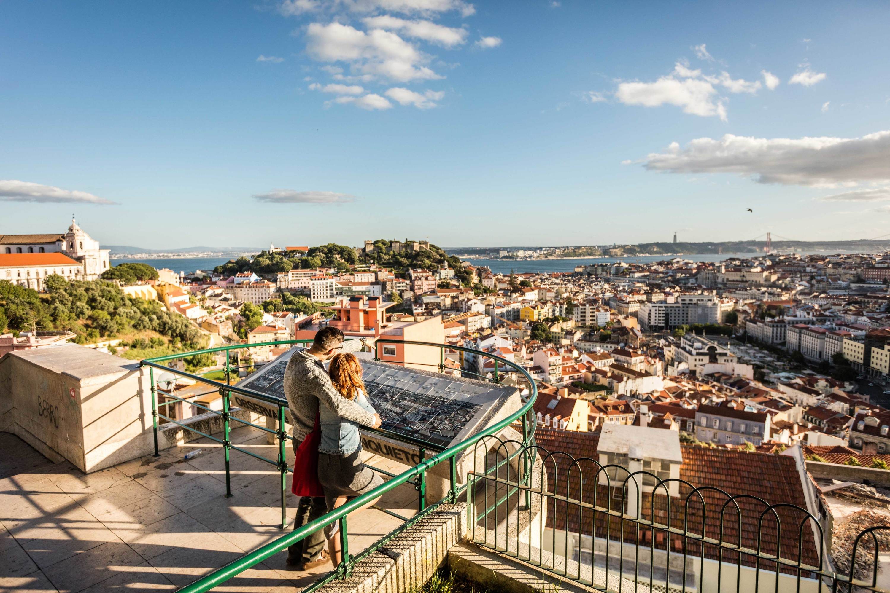
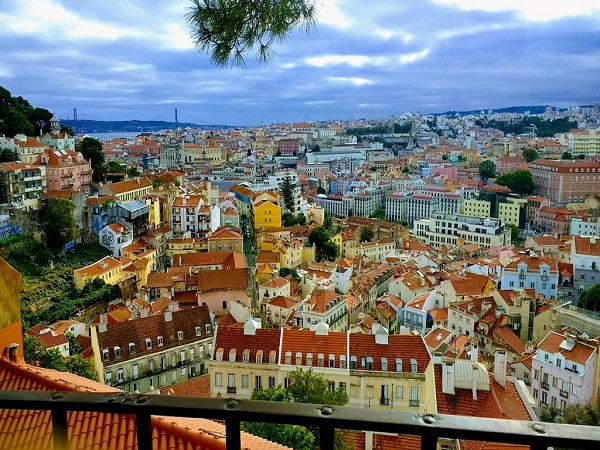

## Baixa江边
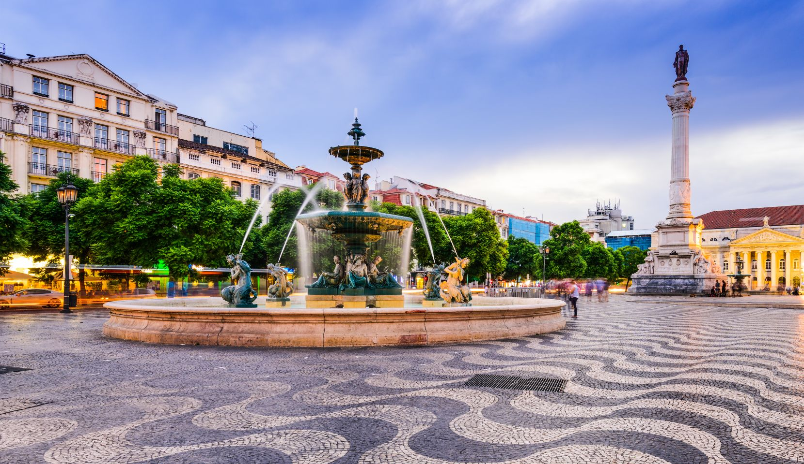
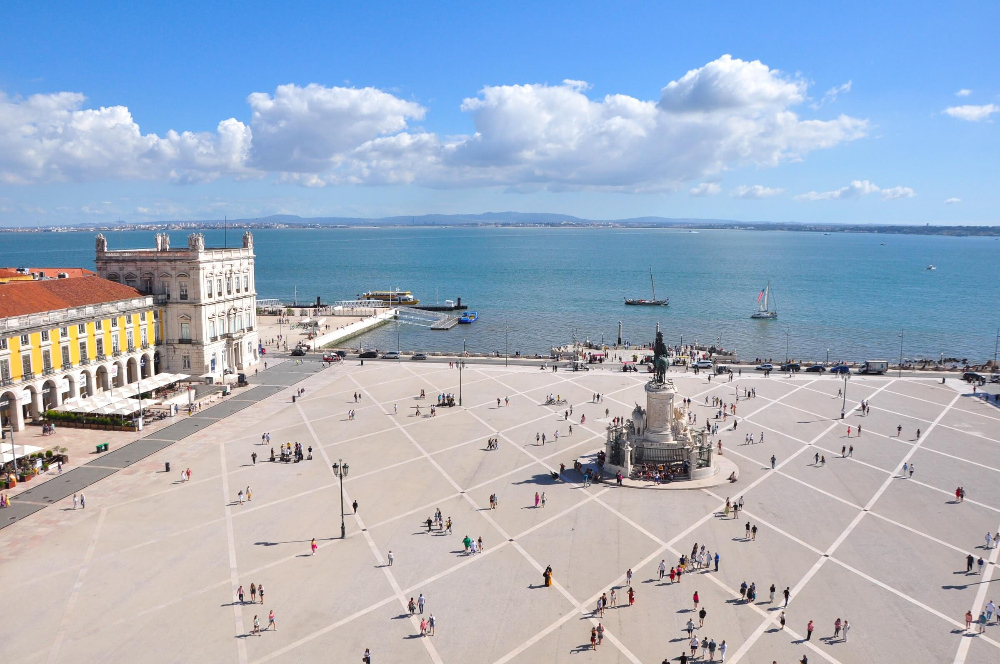

## 28路电车
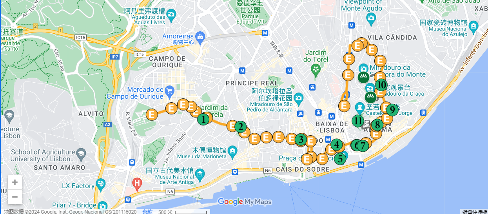
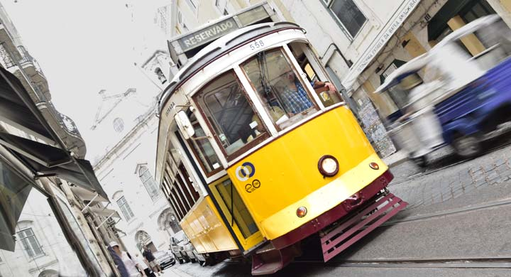

## 天涯海角

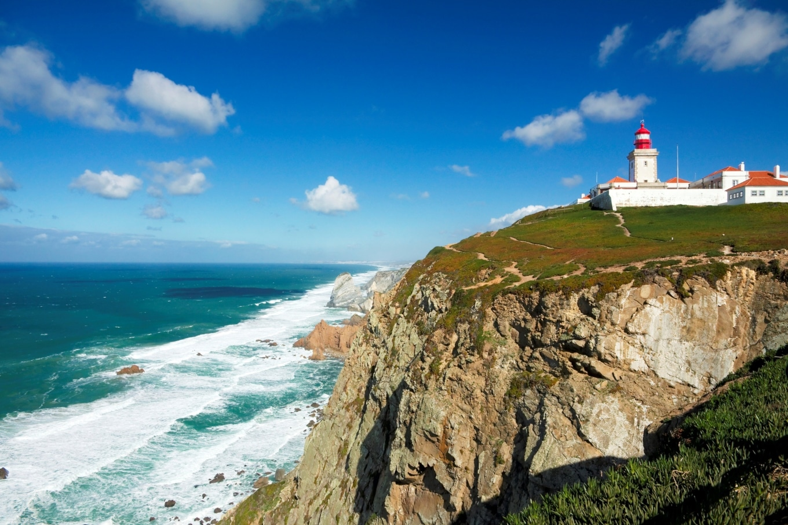

路程网站: https://www.rome2rio.com/pt/map/Lisboa/Cabo-da-Roca#trips

* 过去: 先火车后公交，4-7欧，1小时55分钟
    * 火车 Sete Rios 开始，往 Sintra 方向并下车
    * Linha train - 18224
    * 公交 Av Desidério Cambournac 1 开始, 往 Cascais 方向，Cabo Da Roca 下车
    * Linha bus - 1624

    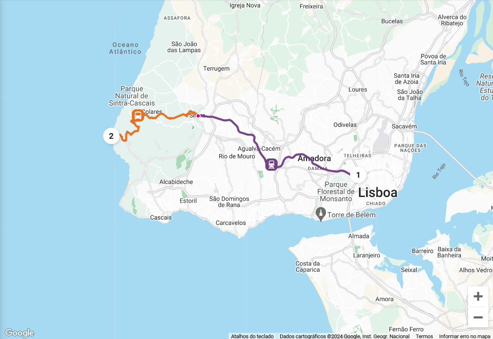

* 回来: 同过去，或者，4-6欧，1小时24分钟
    * 公交 Cabo da Roca 开始，往 Sintra 方向， Estr Do Cabo Da Roca 下车
    * Linha bus - 1253
    * 公交 Estr Do Cabo Da Roca 开始，往 Cascais 方向， Av Marginal 下车
    * Linha bus - 1624
    * 火车 Cascais 开始，往 CAIS DO SODRE 方向并下车
    * Linha train - 19024

    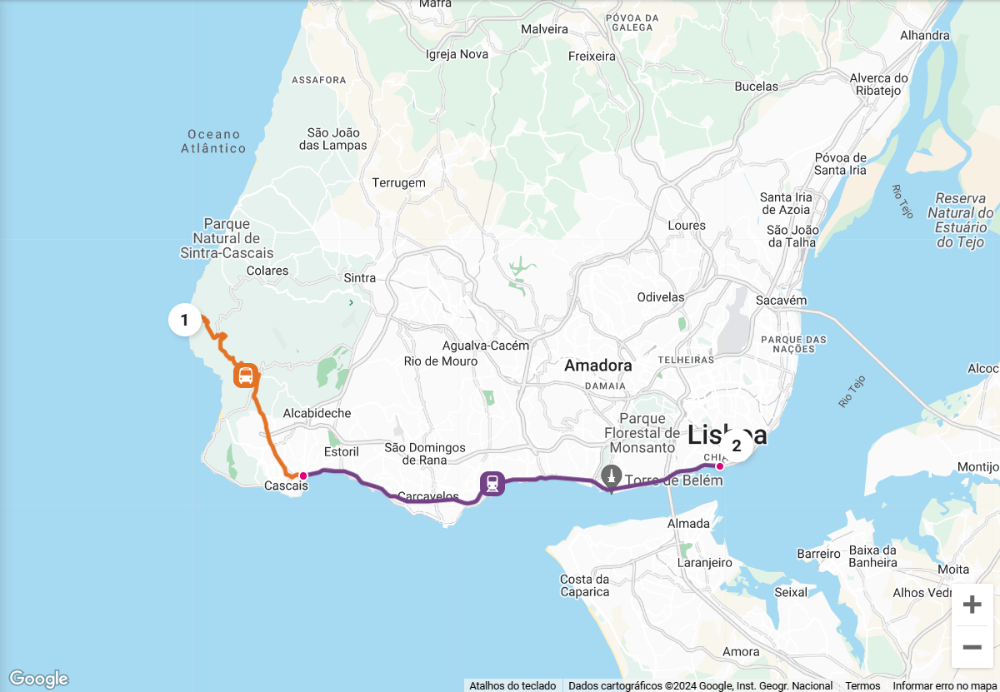

## 餐馆

### 吃饭

* Uma (Marisqueira Uma)
    * 地址: [R. dos Sapateiros 177, 1100-044 Lisboa](https://www.google.com/maps/place/Uma/@38.7120355,-9.1389131,19.5z/data=!4m6!3m5!1s0xd193478c0244753:0x15cb220b42535418!8m2!3d38.7120217!4d-9.1386973!16s%2Fg%2F11b7fvftr6?entry=ttu)
    * 位置: Baixa-Chiado 和 Rossio 中间 (地铁)
    * 评分: 4.3

* Maria Catita
    * 地址: R. dos Bacalhoeiros 30, 1100-389 Lisboa
    * 位置: Terreiro do Paço (地铁)
    * 评分: 4.6

* Pinóquio (推荐的人挺多的)
    * 地址: Praça dos Restauradores 79 80, 1250-188 Lisboa
    * 位置: Restauradores (地铁)
    * 评分: 4.2

* Frade dos Mares
    * 地址: Av. Dom Carlos I 55A, 1200-647 Lisboa
    * 位置: Santos (火车)
    * 评分: 4.7

* Rosa da Rua
    * 地址: R. da Rosa 265, 1200-385 Lisboa
    * 位置: 偏僻，找公交吧，最近的地铁，restauradores
    * 评分: 4.6

* Carvoaria Jacto
    * 地址: R. Maria Andrade 6A, 1170-216 Lisboa
    * 位置: 偏僻，找公交吧，最近的地铁，Intendente
    * 评分: 4.6

* O Vitral
    * 地址: R. Passos Manuel 126, 1000-059 Lisboa
    * 位置: 偏僻，找公交吧，最近的地铁，Arroios
    * 评分: 4.4

* Cervejaria Ramiro
    * Av. Alm. Reis 1 H, 1150-007 Lisboa
    * 位置: Intendente 和 Martim Moniz 之间
    * 评分: 4.4

### 甜点

* Casa Piriquita - Lisboa
    * 地址: [Av. de Roma 20B, 1000-265 Lisboa](https://www.google.com/maps/place/Casa+Piriquita+-+Lisboa/@38.7439781,-9.1396839,18.5z/data=!4m6!3m5!1s0xd1933869f31bc51:0xf0eec300c6dffac1!8m2!3d38.743928!4d-9.1388433!16s%2Fg%2F11t6hn_34d?entry=ttu)
    * 位置: Areeiro (地铁)
    * 评分: 4.5

* Breakfast Lovers Misericórdia
    * 地址: [Calçada do Combro 45, 1200-114 Lisboa](https://www.google.com/maps/place/Breakfast+Lovers+Miseric%C3%B3rdia/@38.710914,-9.1495552,17z/data=!3m1!4b1!4m6!3m5!1s0xd1935e0c223c3dd:0x655bfca187f3e0e4!8m2!3d38.710914!4d-9.1469803!16s%2Fg%2F11tcwnq4pf?entry=ttu)
    * 位置: Baixa-Chiado (地铁)
    * 评分: 偏僻，找公交吧，最近的地铁，Cais do Sodré 上面

### 礼品

* Licor 35 - A NATA DE LISBOA LDA (蛋挞杯子)
    * 地址: [R. Augusta 280 5](
        https://www.google.com/maps/place/R.+Augusta+280+5,+1100-422+Lisboa/@38.712772,-9.1398722,17.71z/data=!4m5!3m4!1s0xd19347899fdb6d7:0x3459384c4ac55e5e!8m2!3d38.7127785!4d-9.1383504?entry=ttu
    )
    * 位置: Rossio (地铁)

* Portugal dos Meus Amores
    * 地址: [Calçada do Sacramento 21, 1200-393 Lisboa](https://www.google.com/maps/place/Portugal+dos+Meus+Amores/@38.7117286,-9.1406678,19.25z/data=!4m14!1m7!3m6!1s0xd1933a789660acf:0x1374d8a588156d6e!2sPortugal+dos+Meus+Amores!8m2!3d38.7115689!4d-9.1404933!16s%2Fg%2F11bbyf1987!3m5!1s0xd1933a789660acf:0x1374d8a588156d6e!8m2!3d38.7115689!4d-9.1404933!16s%2Fg%2F11bbyf1987?entry=ttu)
    * 位置: Baixa Chiado